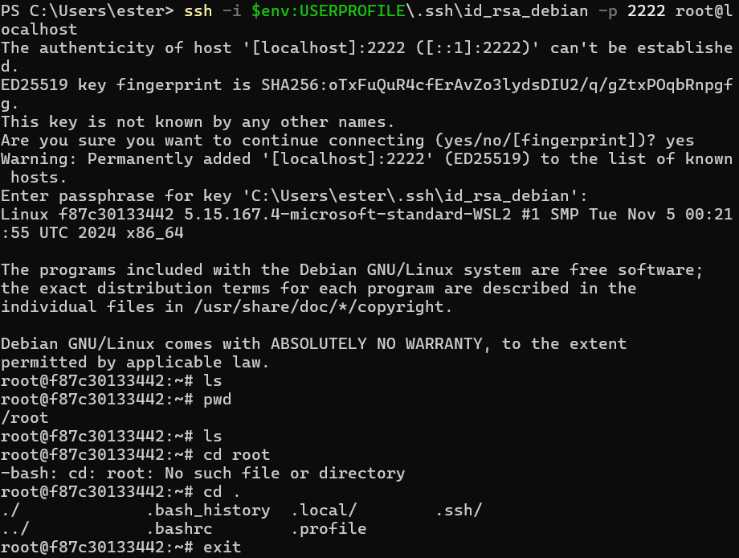

# **Guía: Configuración de Acceso SSH con RSA en un Contenedor Debian (Docker en Windows)**
## 📌 Paso 1: Generar las claves SSH en Windows
Abre PowerShell y ejecuta el siguiente comando para generar un par de claves SSH:

```bash
ssh-keygen -t rsa -b 4096 -f $env:USERPROFILE\.ssh\id_rsa_debian
``` 
Cuando te pregunte una passphrase, puedes dejarlo en blanco o escribir una para mayor seguridad.

Verifica que los archivos se han creado correctamente con:

```bash
ls $env:USERPROFILE\.ssh\
```
Debes ver dos archivos:

id_rsa_debian → Clave privada (No compartir).
id_rsa_debian.pub → Clave pública (Esta sí se usará).
## 📌 Paso 2: Crear un contenedor Debian en Docker
Ejecuta el siguiente comando en PowerShell para crear y ejecutar un contenedor Debian:

```bash
docker run -dit --name debian_ssh -p 2222:22 debian bash
Verifica que el contenedor está corriendo con:
```
```bash
docker ps
```
Si todo está bien, debería aparecer algo como:

```bash
CONTAINER ID  IMAGE   COMMAND   PORTS                   NAMES
abc1234       debian  "bash"    0.0.0.0:2222->22/tcp    debian_ssh
```

## 📌 Paso 3: Acceder al contenedor e instalar el servidor SSH
Para acceder al contenedor, usa:

```bash
docker exec -it debian_ssh bash
```
Dentro del contenedor, instala el servidor SSH:

```bash
apt update && apt install -y openssh-server nano
```

## 📌 Paso 4: Configurar la clave pública en el contenedor
Crea la carpeta donde se guardarán las claves SSH:

```bash
mkdir -p /root/.ssh
```

Abre el archivo authorized_keys con nano:

```bash
nano /root/.ssh/authorized_keys
```

En otra ventana de PowerShell (fuera del contenedor), copia la clave pública:

```bash
Get-Content $env:USERPROFILE\.ssh\id_rsa_debian.pub
```
Copia el contenido que aparece (debería empezar con ssh-rsa y terminar con ester@Javi-portatil).

Regresa al contenedor y pega la clave pública en nano.

Guarda y cierra nano con CTRL + X, luego Y, y presiona ENTER.
Establece los permisos correctos:

```bash
chmod 600 /root/.ssh/authorized_keys
chmod 700 /root/.ssh
```
## 📌 Paso 5: Configurar el servidor SSH
Edita el archivo de configuración SSH:

```bash
nano /etc/ssh/sshd_config
```
Modifica estas líneas (quítales el # si están comentadas):

```bash
PermitRootLogin prohibit-password
PubkeyAuthentication yes
PasswordAuthentication no
```

Guarda y cierra nano (CTRL + X, luego Y, y ENTER).

Reinicia el servicio SSH:

```bash
service ssh restart
```
Verifica que el servicio SSH está corriendo:

```bash
service ssh status
```
Sal del contenedor:

```bash
exit
```

## 📌 Paso 6: Conectarse al contenedor desde Windows
Desde PowerShell en Windows, intenta conectarte al contenedor usando la clave privada:

```bash
ssh -i $env:USERPROFILE\.ssh\id_rsa_debian -p 2222 root@localhost
```


Si todo está bien, te conectarás sin que te pida contraseña.En mi caso le puse contraseña.
